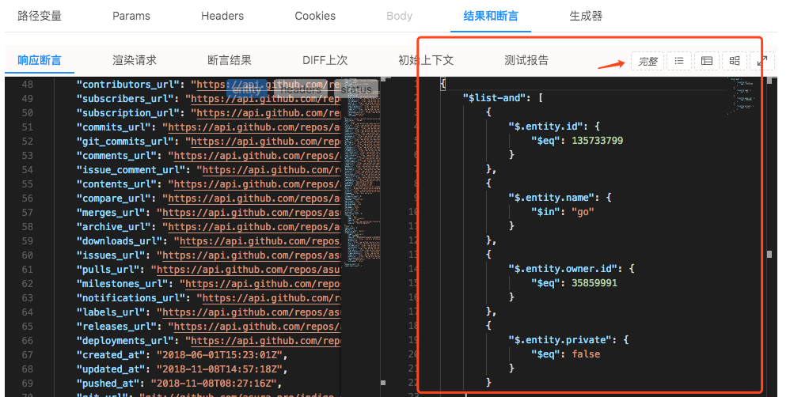

# 断言参考

> 断言可以看作一个返回值为 `true`或`false` 的函数。通常的表现形式：

- 给个 `实际值` 和 `期望值`，判断两个值是否符合某种关系。如：相等，大于，包含 ...
- 给个 `实际值`，判断这个 `实际值` 是否满足某种条件。如：满足某个正则，非空 ...

> 因为俺会把请求的响应放到[执行上下文](/zh-cn/context)中，而上下文的数据模型是一个`JSON结构体`。所以俺执行断言的基本规则是：使用[JsonPath](https://goessner.net/articles/JsonPath/)这种写法先定位`实际值`，然后再执行相应的断言规则。[JsonPath](https://goessner.net/articles/JsonPath/) 由 `$.` 或 `$[` 开头，`$` 代表当前的 JSON结构体 的根，可以进行嵌套。

## $ ~ 编辑断言的用户界面

> 俺的系统内部断言的真实面目是个标准的 `JSON数据体`。但是面世的有以下两个面目：

### 默认的

> 这种是默认的展示方式，功能比较简单，只支持`与`和`或`的逻辑，俺觉得可以满足绝大多数需求。下面的图片示例中就是那四个断言全为真。
> 

### 完备的

> 这种是功能完备的模式支持所有的断言功能，点击那个按钮可以切换两种模式。下面图片中的例子和上面的是完全等价的。`$list-and` 和 `$list-or` 两种断言对应默认模式显示的数据。如这个例子中的 `$list-and` 就是上图显示的数据。详细参考看下面。
> 

## $eq ~ 等于

> 支持基本数据类型 `byte`, `short`, `int`, `long`, `float`, `double`, `char`, `boolean`  和 `stirng`。

## $ne ~ 不等于

> 支持基本数据类型 `byte`, `short`, `int`, `long`, `float`, `double`, `char`, `boolean`  和 `stirng`。

## $gt ~ 大于

> 支持基本数据类型 `byte`, `short`, `int`, `long`, `float`, `double`, `char`, `boolean`  和 `stirng`。

## $gte ~ 大于等于

> 支持基本数据类型 `byte`, `short`, `int`, `long`, `float`, `double`, `char`, `boolean`  和 `stirng`。

## $lt ~ 小于

> 支持基本数据类型 `byte`, `short`, `int`, `long`, `float`, `double`, `char`, `boolean`  和 `stirng`。

## $lte ~ 小于等于

> 支持基本数据类型 `byte`, `short`, `int`, `long`, `float`, `double`, `char`, `boolean`  和 `stirng`。

## $in ~ 包含

> 支持`数组`和`string`类型。如果是数组，数组中的数据类型需要是基本数据类型或字符串。如果是字符串判断是否含有子串。

## $nin ~ 不包含

> 非 `$in` 的结果。

## $size ~ 字符串或数组长度

> 数组大小或字符串长度。

## $regex ~ 匹配正则

> 字符串符合正则。

## $is-null ~ 是否为 null

> 是否为 `null` `undefined`。
```json
{ 
  "$is-null" : true // or false
}
```

## $is-empty ~ 是否为空字符串或空数组

> 数组大小为 0，或空字符串。
```json
{ 
  "$is-empty" : true // or false
}
```

## $type ~ 字段类型

> 判断实际值的类型, 支持类型如下：

- boolean

> 值为 `true` 或 `false`

- byte

>数字， -128 ~ 127

- short

>数字，16-bits， -32,768 ~ 32,767

- int

>数字，32-bits -2^31 ~ 2^31-1

- long

>数字，64-bits，-2^63 ~ 2^63-1

- float

> 单精度浮点

- double

> 双精度浮点

- string

> 字符串

- array

> 数组

- map

> 类型为 `Map`/`Object`

- null

> 数据为 `null`/`undefined`


## $and ~ 逻辑与

> 逻辑与。期望值是一组断言。

## $list-and ~ 逻辑与

> 同 `$and`

## $or ~ 逻辑或

> 逻辑或。期望值是一组断言。

## $list-or ~ 逻辑或

> 同 `$or`

## $nor ~ 逻辑或非

> 逻辑或非。期望值是一组断言。

## $script ~ 脚本

> 执行一段 `Javascript`（[Nashorn](https://en.wikipedia.org/wiki/Nashorn_(JavaScript_engine))，和浏览器中的JavaScript有些不同）脚本，理论上可以实现任何断言功能，缺点是执行速度稍慢，不建议使用。`$` 代表当前实际值，可直接在脚本中引用，脚本执行的最后结果值是 `true` 或 `false` 。

> 假设响应体:
```json
{
    "name": "indigo",
    "owner": {
        "login": "indigo-api",
    }
}
```
```json
{
    "$script" : "$.entity.name=='indigo' && $.entity.owner.login.startsWith('indigo')"
}
```